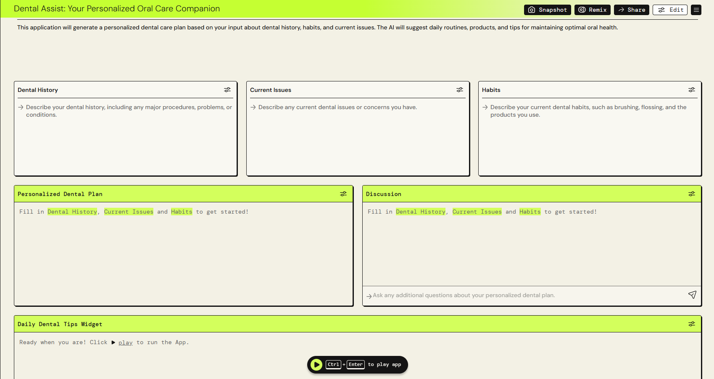

# Dental Assist: Your Personalized Oral Care Companion

## About the Project

Dental Assist is an AI-powered application designed to provide personalized oral care advice to users. Leveraging advanced AI models, it offers tailored recommendations to help maintain optimal dental health.

## Features

- **Dental History Input**:  
  Users can enter detailed information about their dental history, including past procedures, problems, or conditions.

- **Current Issues Section**:  
  A dedicated space for users to describe their current dental issues or concerns.

- **Habits Tracker**:  
  Allows users to input their current oral care habits, such as brushing frequency, flossing, and products used.

- **Personalized Dental Plan Generator**:  
  Automatically creates a customized dental care plan based on the user's dental history, habits, and current issues.

- **Interactive Discussion Panel**:  
  Users can ask additional questions about their personalized plan or receive tailored advice.

- **Daily Dental Tips Widget**:  
  Provides actionable and easy-to-follow daily tips for better oral health.

## Accessing the App

You can access Dental Assist through the following link:

[Dental Assist Application](https://partyrock.aws/u/KanikaMathur/nHSnJpc4M/Dental-Assist%3A-Your-Personalized-Oral-Care-Companion)

## Snapshot

*Caption: Home screen of Dental Assist.*

## Connect with me 

**Kanika Mathur**  
- [E-mail](mkanika.90@gmail.com)
- [GitHub](https://github.com/KanikaGenesis)  
- [LinkedIn](https://www.linkedin.com/in/kanika-mathur-083080121)  

